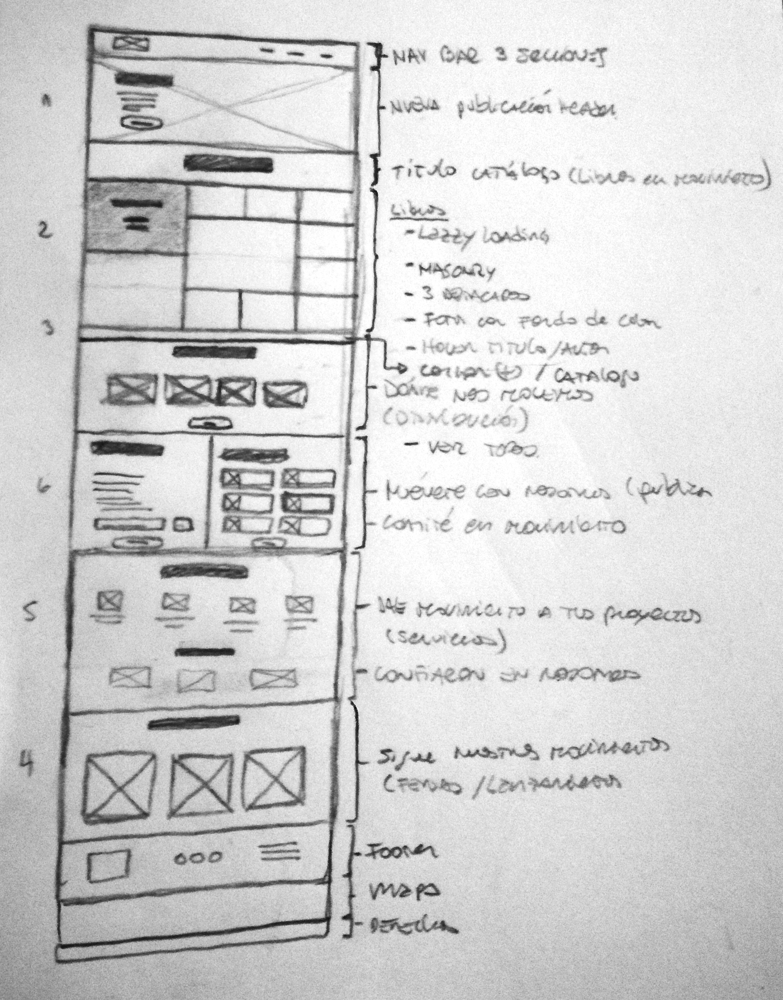

# Primer entregable - Proyecto Final

https://kimlouu.github.io/proyectofinal2/index.html

## Editorial AM

### Requerimientos generales:

- **Layout:** Responsive Landing page para la promoción de los libros y los servicios editoriales de AM.

  **Objetivos del sitio:** Tener una vitrina web inicial en donde se pueda apreciar el trabajo de la Editorial tanto para quienes quieran adquirir libros, quienes necesiten la prestación de servicios editoriales o quienes quieran publicar con la misma. La idea es que el sitio pueda ser escalable y en un futuro considerar la compra directa dentro del mismo sitio, por el momento la plataforma para la venta de libros es una plataforma externa.

- **Navbar con navegación de 3 elementos + brand**
    - La Editorial
    - Catálogo
      Servicios
      Contacto

- **8 Secciones:**
    - Header de novedades, ícono de desplazamiento
    - Libros en Movimiento: Catálogo, Destacar 2das ediciones, Lazzy Loading, Mazonry (Flat - colores - over titulo autor - ver más)
    - Dónde nos movemos (distribuidoras)
      Sigue nuestros movimientos (Ferias y lanzamientos)
      Muévete con nosotros (Publicación)
      Dale movimiento a tus proyectos (Servicios)
      Comité en Movimiento
  Footer:
    - Logo y contacto (Nova Fronteira akal)

### Requerimientos específicos:

- Icons:
    - Font-Awesome
- Textos
    - Pocos disponibles
- Grid system:
    - Bootstrap
  Título de libros:
      Mini interacción Hover
  Vista Rápida de Libros:
      Lightbox
  Cargar más libros:
      Lazzy Loading

### Requerimientos visuales:

- Layout:
    - Bootstrap: Minimal-flat
- Tipografía:
    - H1: Inknut Antiqua
    - H2: Inknut Antiqua
      H3: Inknut Antiqua
    - P: Lato
- Colores:
    - Imágenes fuertemente coloridas, textos en negro y grises, hover color corporativo.
      h1-h2-h3: black.
      Secundario: gray.
      Destacado: #009999
- Imágenes:
    - No disponibles
      Simulación de como deberían ser
- Icons:
    - Font-awesome

### Sketch Desktop Version:

### Estructura:
